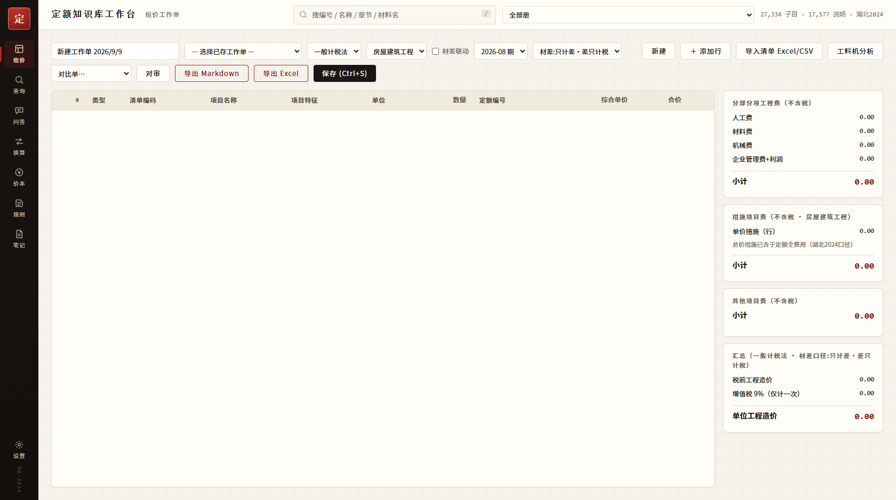
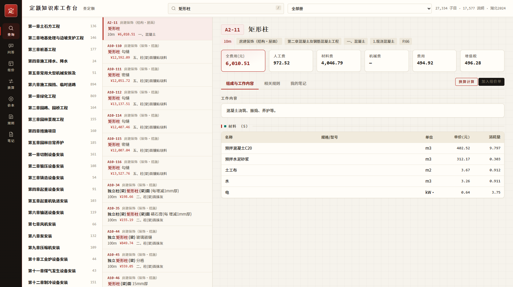
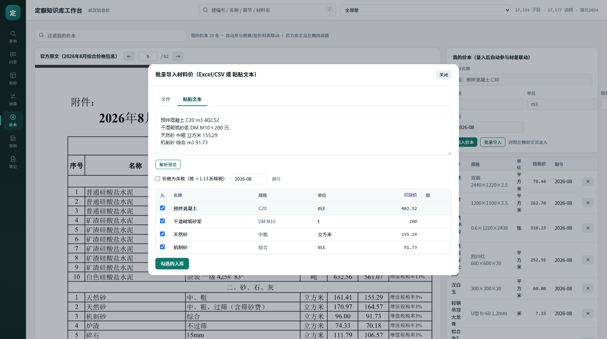

# 定额知识库工作台 · De Quota Workbench

[](https://kyo-zmol.github.io/de-quota-workbench/) [](https://github.com/Kyo-zmol/de-quota-workbench)

> 在线演示（静态·BYO-data）：https://kyo-zmol.github.io/de-quota-workbench/ 　|　仓库：https://github.com/Kyo-zmol/de-quota-workbench

> 一名造价员的 AI 工作台：把湖北省 2024 定额（27,334 子目 / 17,577 条说明规则）变成可搜索、可组价、可换算、可沉淀经验的本地优先专业工具。
> A local-first AI workbench that turns Hubei-2024 construction quotas (27,334 items / 17,577 rule clauses) into a searchable, estimatable, convertible, experience-accumulating professional tool.

[](LICENSE) [](#) [](#数据合规-data-compliance)



## 为什么做这个 / Why
造价员的日常＝翻定额书、查说明、套子目、调换算、攒经验。商业软件贵且黑箱；本项目把**数据工程 + 计价方法论 + 设计系统**三件事一次做对，作为可公开验证的作品集。

## 功能一览 / Features
| 模块 | 能力 | 亮点 |
|---|---|---|
| 组价（开屏） | 清单行→定额匹配→三级费用汇总 | 不含税口径、增值税仅计一次、总价措施不重计（湖北2024口径实证） |
| 清单导入 | Excel/CSV 一键成稿 | 零依赖 OOXML 解析器（自写），表头智能映射 |
| 查定额 | 27,334 子目全字段检索 | 材料名反查、册先验权重、页码溯源 |
| 换算 | 系数/材料换价/预设库 | 官方费率正算 + 隐含费率对照显示 |
| 价本 | 官方原文阅读器 + 批量导入 | 粘贴文本智能解析、含税自动折算、多期 |
| 问答 | 定额+规则+笔记三路证据 | 证据式 RAG，条条带出处，不瞎编 |
| 习惯卡 | 经验结构化自动命中 | 笔记句式提炼候选、组价/换算自动应用 |
| 工料机/对审/导出 | 分析表、Δ表、Excel(带公式)/Markdown | 成果文件级输出 |
| 数据自检 | 恒等校验报告 | 全费用=人+材+机+费+税；缺口标记不静默 |

 

## 技术亮点 / Engineering highlights
- **零依赖服务端**：单文件 Node http 服务；xlsx 读写自写 OOXML（JSZip 仅用于 zip 容器）
- **PDF 表格解析器**：坐标聚类 + 合并单元格/全角/上标/竖排标签/跨页续表处理；29 册 9,989 页全量解析
- **计价方法论实证**：用恒等式反推定额费用组成（管理费+利润+安全文明+其他总价措施），修正双重计税与措施重计
- **设计系统 v3「宣纸·朱砂」**：e-ink paper × 台账印章基因；宋体标题/等宽数字/朱砂强调；[DESIGN.md](DESIGN.md) 全令牌归档
- **并发下载器**：16 路 Range 分块，36MB 官方 PDF 17 秒（单连接 40 分钟）
- 架构详见 [docs/ARCHITECTURE.md](docs/ARCHITECTURE.md)，演进史见 [docs/CHANGELOG.md](docs/CHANGELOG.md)

## 快速开始 / Quick start
```bash
# 本地（自带演示样本集 demo/，4,448 子目）
cd app && node server.js          # http://127.0.0.1:8730
# 全量数据：自行获取官方发布件 → scripts/parse_all.js（见下）
# 桌面壳：desktop/定额知识库工作台.exe（Electron 便携版，需自备）
# Docker：docker build -t deqw . && docker run -p 8730:8730 deqw
```

## 数据合规 / Data compliance
- 仓库**只含代码与明确标注的演示样本**（`demo/`：结构册全量+其余册前120条+1,500条规则，来源政府公开发布件，标注"仅演示与个人学习"）
- 全量解析结果、官方 PDF、个人价本/工作单/笔记**不入库**（.gitignore）
- 复现全量：湖北省住建厅官网取《2024等9项定额》发布件 → `scripts/parse_all.js`（29册并发解析约4分钟）

## 隐私 / Privacy
- **零遥测**：服务纯本地回环（127.0.0.1），无任何外呼统计/埋点；唯一网络行为＝用户主动触发的官方文件下载
- **仓库零个人数据**：不含真实价本/工作单/笔记（demo 为通用示例内容并标注 sample）；不含设备路径/用户名/IP
- 解析脚本 node_modules 走 NM_DIR 环境变量或仓库根 node_modules（不入仓），运行路径不泄露
- 部署提示：公开演示 URL 会暴露其上数据——默认仅挂载 demo 样本集；自有数据部署请私有化

## 部署 / Deploy
- **Render 一键**：[](https://render.com/deploy)（render.yaml 已备，免费档）
- **任意 VPS**：Dockerfile（node:20-alpine）；自有全量数据挂载 `/data` 并覆盖 `WB_PROC/WB_NOTES/WB_PROJ`
- GitHub Pages 静态版（BYO-data）在路线图中

## 路线图 / Roadmap
解析缺口专项（公共专业费用行版式）→ 附加税条款考证 → LLM 生成层 → Pages 静态 BYO-data → 移动端适配

## License
MIT（代码）。数据声明见 [LICENSE](LICENSE) DATA NOTICE。


## English Abstract
A local-first, offline-capable workbench for construction cost engineering (Hubei 2024 quotas): 27,334 quota items and 17,577 clause rules parsed from official government PDFs by a zero-dependency pipeline; features include BOQ importing (hand-written OOXML parser), three-level fee aggregation audited against the provincial fee quota (single-layer VAT, surcharges modeled per tax locality), conversion calculator with official rate forward-computation, material price-book linkage, evidence-based RAG Q&A with optional BYO-key LLM generation, and habit-rule cards that codify estimator judgment. The design system "Xuanzhi-Zhusha" (rice-paper & cinnabar seal) grounds the UI in the domain ledger heritage. Code and data are strictly separated for compliance; the static GitHub Pages build ships a labeled demo subset with BYO-data import.

## 变更史
- v1.0.0 首发：六模块+静态BYO-data+合规分离
- v1.1.0 夜审模式
- v4.0 舞台+容器查询跨设备互看（零FOUC）
- v4.1 子目级QA徽章+自动愈合+人工核录队列；顶栏/工具条治理
- v4.2 自检矩阵 ALL PASS 修复轮（切换钮/底轨固定/更多菜单/ favicon）
