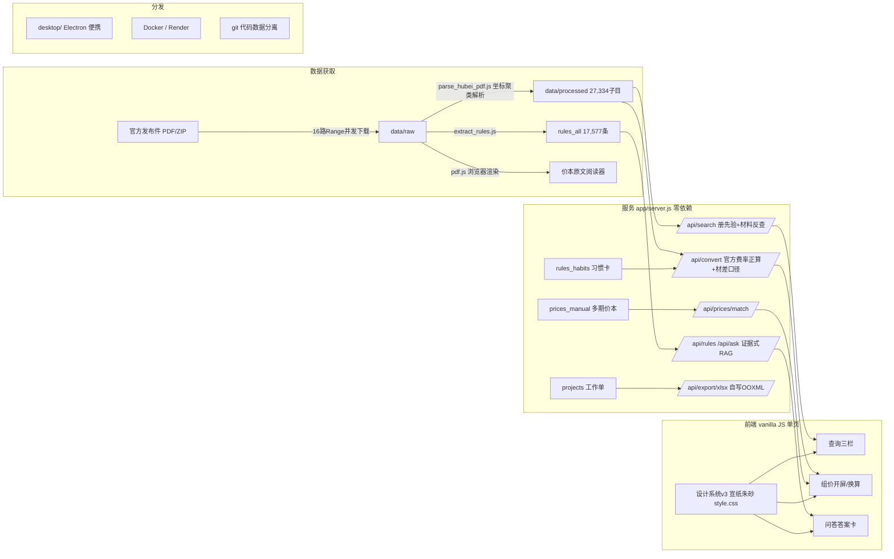

# 架构 / Architecture

## 关键决策记录 / ADR 摘要
1. **本地优先**：造价数据敏感+离线工地场景 → 零依赖 Node 服务 + 文件存储，云部署为可选分发形态
2. **不含税口径汇总**：GB50500 与湖北2024费用定额实证（恒等式反推）→ 增值税单层计取
3. **证据式 RAG 而非生成式**：离线无 LLM → 答案=排序证据+模板合成，出处可点
4. **代码/数据分离开源**：版权与隐私边界 → demo/ 标注样本随仓，全量自解析
5. **设计基因=主体性**：造价=台账与印章 → 宣纸/墨/朱砂/宋体，反 SaaS 模板脸
